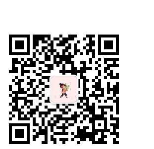

# 手把手微信公众号接入AI讯飞星火认知大模型

## 导言

> 你也想拥有属于自己的ai助手吗？
>
> **本教程手把手教你微信公众号接入ai讯飞星火认知大模型**
>
> 扫码即可体验
>
> 

> 

## 前提条件

### 需要有基本的微信公众号开发技能

> 没有也不怕，我有教程
>
> 微信公众号教程
>
> 
>
> https://www.bilibili.com/video/BV14E421A7Gr/

### 需要有基本的服务器知识

> 没有也不要怕，我有教程
>
> 

> [前端项目构建打包部署【内网穿透，购买云服务器，配置宝塔，搭建http服务】（视频教程）_哔哩哔哩_bilibili](https://www.bilibili.com/video/BV1ep4y1T7aP/?spm_id_from=333.999.0.0)

### 需要使用过讯飞星火大模型

> 没有使用过也不怕
>
> 注册一个账号玩一下
>
> [讯飞星火大模型-AI大语言模型-星火大模型-科大讯飞](https://xinghuo.xfyun.cn/desk)
>
> 
>
> 

## 正片开始

### 准备

- 克隆本项目
  - 

- 需要有一个域名，支持https服务（微信公众号官方要求：域名需要备案，且支持https服务）

  - 可以在各大云服务商购买一个域名，然后备案（一两个星期左右），头一年只要一块钱

- 有一个服务器（通过域名可以访问到这个服务器上服务）

  - 可以购买各大云服务上的云服务器部署项目
  - 可以使用severless平台部署项目

- 注册一个微信公众号

  - 拿到以下内容，一会需要填写这些信息项目配置文件中

  - ```
    token:"",
    appid: 'xx',// 公众号码appid
    appsecret: 'xx',// 公众号appsecret
    server_url: "xxx",// 自己的域名
    ```

    

  - 

- 到讯飞开发平台注册账户，这样可以添加应用

  - [讯飞开放平台-以语音交互为核心的人工智能开放平台 (xfyun.cn)](https://www.xfyun.cn/)

- 到讯飞控制台添加一个应用，这样可以获取 APPID，APISecret，APIKey等

  - [控制台-讯飞开放平台 (xfyun.cn)](https://console.xfyun.cn/app/myapp)

  - 创建一个新应用

    - 

  - 选择一个你要使用的版本

    - 

    - 记得购买token，都是免费的

    - ```
      // Tips: 星火大模型API当前有Lite、Pro、Pro-128K、Max、Max-32K和4.0 Ultra六个版本，各版本独立计量tokens。
      
      // 传输协议 ：ws(s),为提高安全性，强烈推荐wss
      
      // Spark4.0 Ultra 请求地址，对应的domain参数为4.0Ultra：
      // wss://spark-api.xf-yun.com/v4.0/chat
      
      // Spark Max-32K请求地址，对应的domain参数为max-32k
      // wss://spark-api.xf-yun.com/chat/max-32k
      
      // Spark Max请求地址，对应的domain参数为generalv3.5
      // wss://spark-api.xf-yun.com/v3.5/chat
      
      // Spark Pro-128K请求地址，对应的domain参数为pro-128k：
      //  wss://spark-api.xf-yun.com/chat/pro-128k
      
      // Spark Pro请求地址，对应的domain参数为generalv3：
      // wss://spark-api.xf-yun.com/v3.1/chat
      
      // Spark Lite请求地址，对应的domain参数为lite：
      // wss://spark-api.xf-yun.com/v1.1/chat
      // 星火配置
      spark_appid: "xxx",
      spark_apisecret: "xx",
      spark_apikey: "xxx",
      spark_domain: 'generalv3',// 看上面注释
      spark_hosturl: "wss://spark-api.xf-yun.com/v3.1/chat",//看上面注释
      ```

- 然后修改项目文件下面的config.js.example

  > 将 `config.js.example`改为 `config.js`（一定要改）
  >
  > 将上面公众号和星火的配置信息填入下面的config.js
  >
  > ```
  > !!!config.js
  > // Tips: 星火大模型API当前有Lite、Pro、Pro-128K、Max、Max-32K和4.0 Ultra六个版本，各版本独立计量tokens。
  > 
  > // 传输协议 ：ws(s),为提高安全性，强烈推荐wss
  > 
  > // Spark4.0 Ultra 请求地址，对应的domain参数为4.0Ultra：
  > // wss://spark-api.xf-yun.com/v4.0/chat
  > 
  > // Spark Max-32K请求地址，对应的domain参数为max-32k
  > // wss://spark-api.xf-yun.com/chat/max-32k
  > 
  > // Spark Max请求地址，对应的domain参数为generalv3.5
  > // wss://spark-api.xf-yun.com/v3.5/chat
  > 
  > // Spark Pro-128K请求地址，对应的domain参数为pro-128k：
  > //  wss://spark-api.xf-yun.com/chat/pro-128k
  > 
  > // Spark Pro请求地址，对应的domain参数为generalv3：
  > // wss://spark-api.xf-yun.com/v3.1/chat
  > 
  > // Spark Lite请求地址，对应的domain参数为lite：
  > // wss://spark-api.xf-yun.com/v1.1/chat
  > 
  > let config = {
  >   // http服务
  >   http_port: 80,
  >   // https服务
  >   https_port: 443,
  >   // 微信公众号配置
  >   token: "xxx",
  >   appid: 'xx',// 公众号码appid
  >   appsecret: 'xx',// 公众号appsecret
  >   server_url: "xxx",// 自己的域名
  >   // server_url: "http://www.xxx.xxx"// 你自己的域名
  >   // 星火配置
  >   spark_appid: "xx",// 星火应用appid
  >   spark_domain: 'generalv3',// 看上面注释
  >   spark_hosturl: "wss://spark-api.xf-yun.com/v3.1/chat",//看上面注释
  > }
  > export default config
  > ```

- 将项目部署在云服务器上
  - 这里我使用pm2部署
  - 执行npm i安装依赖
  - 执行pm2 start server
  - 

- 完成
- 公众号可以访问了
- 

## 结尾

推荐我的另一个项目[zou-hong-run/xinghuo: 讯飞星火认知大模型接入网页](https://github.com/zou-hong-run/xinghuo)

这个项目比较简单，本地就能运行


